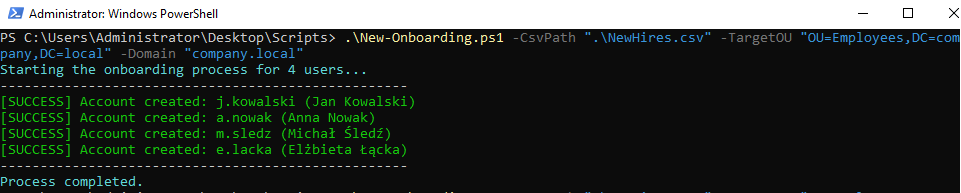
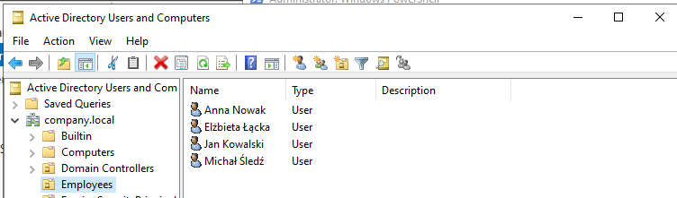

# Active Directory User Onboarding Automation 🚀


**Automated identity provisioning for IT Helpdesk**
This project involves a PowerShell script designed for Helpdesk and IT Support teams to automate the process of creating new user accounts in Active Directory. It solves the problem of manual, error-prone data entry by reading user details from an HR-provided CSV file and provisioning the accounts seamlessly.

## 🛠️ Technologies
* PowerShell (Scripting & Automation)
* Active Directory Domain Services (AD DS)
* RSAT (Remote Server Administration Tools)
* CSV Data Manipulation

## ✨ Features
* **Bulk User Creation:** Reads user details (Name, Department, Job Title) from `NewHires.csv`.
* **Standardized Naming Convention:** Automatically generates usernames in the `FirstInitial.LastName` format.
* **Character Normalization:** Replaces special/diacritic characters (e.g., `ą, ć, ł`) to prevent login and email issues.
* **Duplicate Prevention:** Checks if the `sAMAccountName` already exists before creation to avoid conflicts.
* **Security & Compliance:** Assigns a secure temporary password and forces a password change at the first logon.
* **Error Handling:** Uses `Try/Catch` blocks to display clean error messages without crashing the script.

## ⚙️ The Process
The deployment followed a structured approach:
1. **Data Preparation:** Structuring the HR data into a standardized CSV format (`NewHires.csv`).
2. **Environment Setup:** Ensuring the Active Directory module is loaded and execution policies allow script running.
3. **Execution:** Running the script with administrative privileges and specifying the target Domain and Organizational Unit (OU).
4. **Processing:** The script sanitizes user input, generates credentials, and communicates with the Domain Controller to create the objects.
5. **Verification:** Confirming the successful creation of accounts in Active Directory.

## 📊 Proof of Concept / Testing

### 1. Script Execution & Console Output


**Action:** Running the `New-Onboarding.ps1` script in PowerShell as Administrator. The output confirms that the CSV file was read successfully and four new user accounts were created without errors, indicated by the green `[SUCCESS]` messages. The script successfully handled Polish characters (e.g., changing "Michał Śledź" to "m.sledz").

### 2. Active Directory Verification


**Action:** Verifying the script's results in the Active Directory Users and Computers (ADUC) console. The newly created users (Anna Nowak, Elżbieta Łącka, Jan Kowalski, Michał Śledź) are correctly placed inside the `Employees` Organizational Unit within the `company.local` domain, confirming the script's parameters worked as intended.

## 💡 What I Learned
* Automating Active Directory tasks using the `ActiveDirectory` PowerShell module (`New-ADUser`, `Get-ADUser`).
* Implementing robust error handling using `Try/Catch` blocks.
* String manipulation in PowerShell (removing diacritics/special characters using custom functions).
* Using Hash Tables (splatting) to pass multiple parameters cleanly to cmdlets.

## 🚀 What can be improved
* Implementing an automatic welcome email notification to the user's manager upon account creation.
* Adding automatic Active Directory Security Group assignment based on the "Department" column in the CSV.
* Exporting the execution results directly to a log file (`.txt` or `.csv`) for auditing purposes.

## How to run the Project
1. Ensure you have Windows Server with AD DS or a Windows client with RSAT installed.
2. Open PowerShell as Administrator and enable script execution by running:
   ```powershell
   Set-ExecutionPolicy RemoteSigned -Scope CurrentUser
